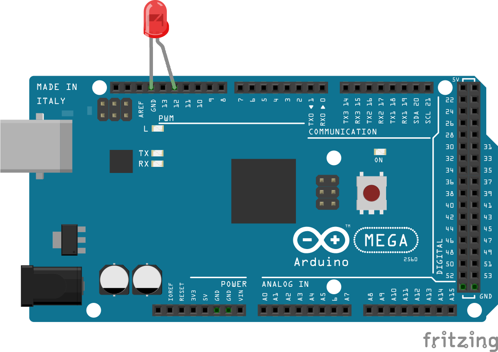

#1-led
**This app allows you to control an LED**

##Setting up the hardware

I used an [arduino mega](https://www.arduino.cc/en/Main/ArduinoBoardMega2560) for this example, but any of the [boards](http://johnny-five.io/platform-support/) supported by johnny-five should work.

Connect an LED directly to pin 12




##Setting up the code


To run, first clone the repo and npm install the example directory

```
git clone https://github.com/sofroniewn/electron-johnny-five-examples
cd electron-johnny-five-examples/1-led
npm install
```

Unfortunately the serial port may not work right away and might need to be rebuilt

```
./node_modules/.bin/electron-rebuild
```

At this point if you try to starting the app with

```
npm start
```
You may get an error if the path to <code>serialport.node</code> is wrong.

```
Uncaught Error: Cannot find module '/Users/sofroniewn/github/electron-johnny-five-examples/1-led/node_modules/johnny-five/node_modules/serialport/build/Release/node-v47-darwin-x64/serialport.node'
```

This can easily be fixed by

```
mv ./node_modules/johnny-five/node_modules/serialport/build/Release/electron-v0.36-darwin-x64/ ./node_modules/johnny-five/node_modules/serialport/build/Release/node-v47-darwin-x64/
```

You're now ready to start the app!

For more information about that error and using electron with johnny-five and node-serialport in general, check out this super helpful [blog post](http://meow.noopkat.com/using-node-serialport-in-an-electron-app/) by [@noopkat](https://github.com/noopkat)

##Running the app
After setting up the [hardware](https://github.com/sofroniewn/electron-johnny-five-examples/tree/master/1-led#setting-up-the-hardware) and [code](https://github.com/sofroniewn/electron-johnny-five-examples/tree/master/1-led#setting-up-the-code) you are now ready to start the app. Run 

```
npm start
```

You should see a screen that looks like this:


If you click the button the LED should turn on!